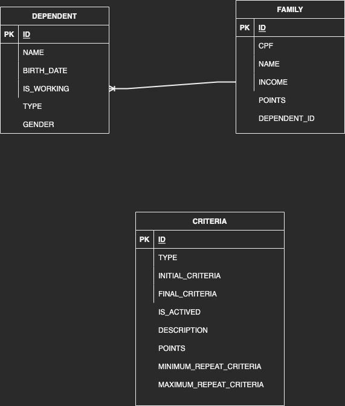

# Desafio Digix

Desafio para treino de desenvolvimento de software.

## Problem
Seleção de famílias aptas a ganharem uma casa popular

Temos um produto e recebemos o desafio de gerar uma lista de pessoas aptas a ganhar uma casa popular do governo, tendo como única exigência que essa lista esteja ordenada de forma mais justa possível com um somatório de pontos, analisando aspectos das famílias que estão participando. São considerados os seguintes critérios para a construção das pontuações:

- Renda total da família até 900 reais - valendo 5 pontos;
- Renda total da família de 901 à 1500 reais - valendo 3 pontos;
- Famílias com 3 ou mais dependentes (lembrando que dependentes maiores de 18 anos não contam) - valendo 3 pontos;
- Famílias com 1 ou 2 dependentes (lembrando que dependentes maiores de 18 anos não contam) - valendo 2 pontos.

O código que faz essa análise hoje é totalmente procedural, repleto de blocos if/else pra analisar e montar as classificações e nos dá muito custo de manutenção, nos motivando a procurar uma nova solução para este problema. Seu desafio é justamente isso, codificar uma forma melhor de chegar no mesmo resultado usando e abusando da orientação à objetos, criando classes e métodos de uma forma que fique tudo mais legível e fácil de manter e estender.

Falando sobre estender, o cliente já deixou um alerta ligado de que irão incluir novos critérios na avaliação das famílias em breve, assim que forem aprovados pelo governador, então temos que ter uma solução preparada para adicioná-los sem muito custo de implementação.

Como iremos focar em avaliar os conceitos usados, também não há necessidade de entregar um código funcionando e muito menos uma interface (tela), seja ela na linha de comando, web ou desktop. O que nos importa mesmo é o código que fará a regra de negócio e como ele estará estruturado.

### Sua missão

O resultado esperado é que as famílias, na listagem, estejam pontuadas de acordo com os critérios que foram atendidos (cada família pode pontuar uma única vez por critério, além de poder atender todos os critérios ou nenhum deles) e ordenadas pela pontuação, favorecendo as famílias melhores pontuadas.

## O que esperamos ver no seu código

- Lógica de programação;
- Capacidade de resolver problemas complexos;
- Orientação à objetos;
- Clean code.

## Aspectos que contariam um ponto a mais se aparecerem no seu código

- Testes automatizados;
- Conceitos de arquitetura;
- Design patterns.

## Demais dúvidas

**O código precisa estar rodando ou funcionando?**

Não, o nosso maior interesse é na sua abordagem de solução, esta sim precisa estar bem implementada.

**Sobre o modelo exibido, famílias podem ter mais de um pretendente ou não ter nenhum?**

Não, uma família sempre possuirá um único pretendente e um único cônjuge.

**Quando devo realizar o desenvolvimento?** Apenas no momento do teste, na data que marcamos com você.
Liberamos o acesso antes da etapa para que tenha a oportunidade de entender o case.

## Getting Started

Para executar a aplicação, execute via terminal o seguinte comando no terminal ou prompt de comando:

```
mvn clean package spring-boot:run
```

### Prerequisites

* Java 11
* SpringBoot 2.5.3
* Maven 3.6.3

### Database

Projeto foi desenvolvido usando banco de dados relacional h2 em memória

### Seguintes Database foram criadas



Onde existe um relacionamento entre Familia e Dependente onde 1 Familia tem muitos Dependentes

Também foi criado uma tabela de Critérios onde é possível adicionar novos critérios de pontuação
a tabela é composta pelos seguintes campos:
* ID: Chave Primária
* INITIAL_CRITERIA: Valor inicial do critério onde podemos por exemplo informar um valor minimo de renda ou idade
* FINAL_CRITERIA: Valor final do critério onde podemos por exemplo informar um valor maximo de renda ou idade
* POINTS: Pontuação do critério
* DESCRIPTION: Descrição do critério
* TYPE: Tipo do critério onde podemos informar se é um critério do tipo DEPENDENT_AGE, INCOME ou IS_WORKING
* IS_ACTIVE: Indica se o critério está ativo ou não
* MINIMUM_REPEAT_CRITERIA: Indica um valor minimo de vezes, por exemplo: Quantos dependentes no minimo uma familia precisa ter
* MAXIMUM_REPEAT_CRITERIA: Indica um valor maximo de vezes, por exemplo: Quantos dependentes no maximo uma familia pode ter

## Running the tests

Testes usam JUnit 5 e Mockito

### Break down into end to end tests

Para executar os testes, execute a seguinte linha abaixo

```
mvn test
```

## Authors

* **Daniel Silva**

## License

This project is licensed under the MIT License - see the [LICENSE.md](LICENSE.md) file for details
